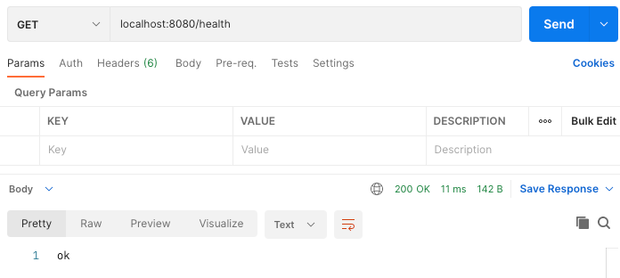
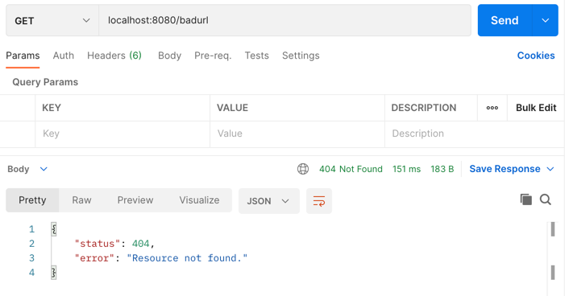
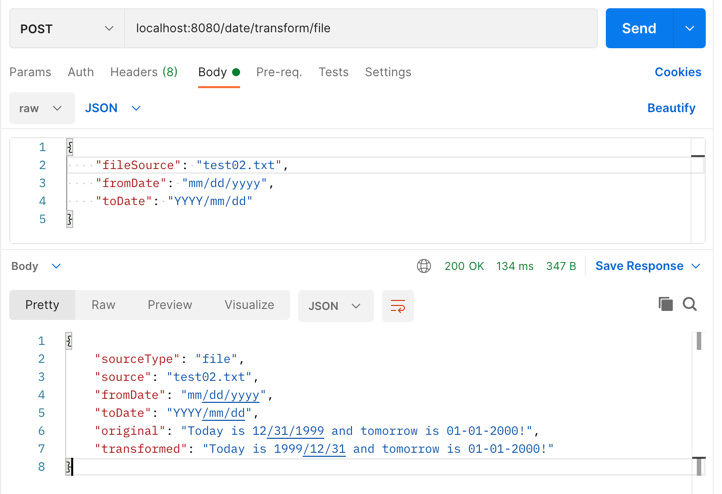
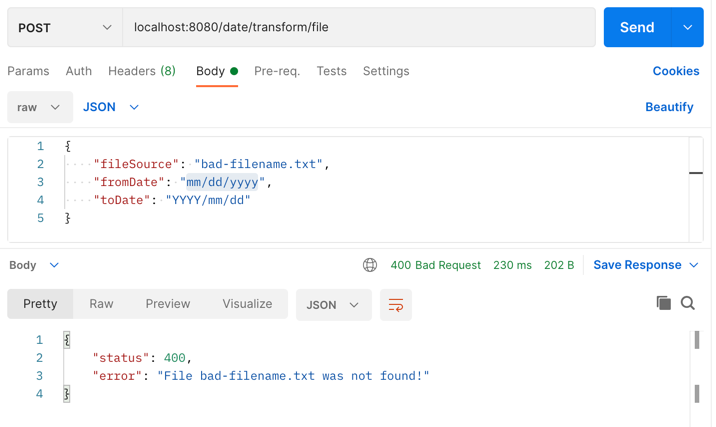
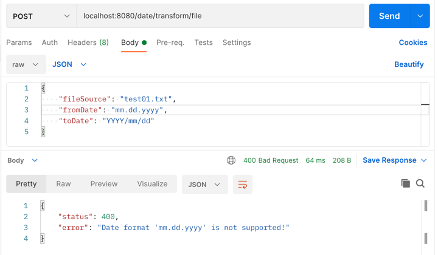
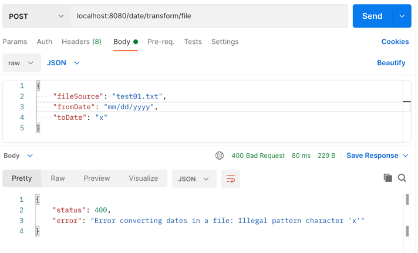
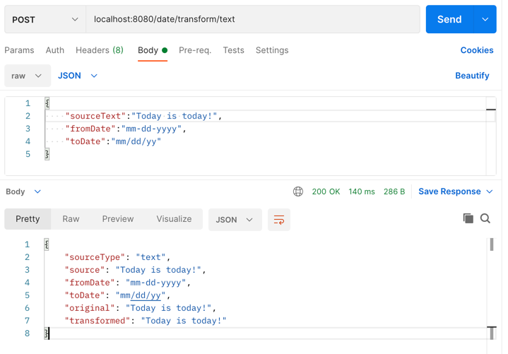
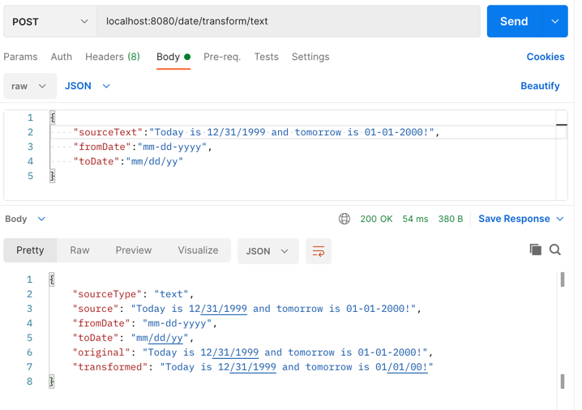
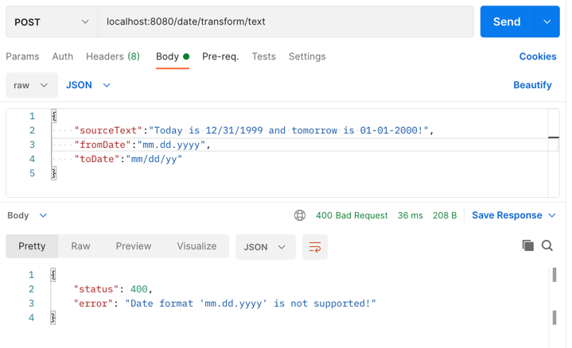
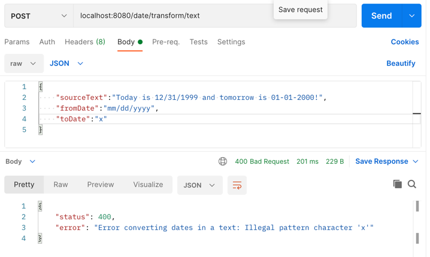

# Date Transforminator! 

## About The Project
This is a code project to showcase a simple Scala web service for converting text from one date format to another. 

Essentially there are two endpoints for this service, `date/transform/file` and `date/transform/text`.

The `file` endpoint will use the contents of the specified file in the configured resources folder as a basis for translation.
The `text` endpoint will use the contents of the JSON request body as a basis for the translation.

The name of the proejct is a shoutout to Phineas & Ferb the TV show which my kids absolutely loved watching growing up. 

## Getting Started

### Prerequisites

- Java 17 (Eclipse Adoptium 17.0.10)
- Scala 3 (3.4.0)
- SBT 1.9.9

### Technical details
This is a web service in Scala using the http4s web server. It has been a few years since I have worked directly with Scala with my last role using Play/Akka and GraphQL. This was a welcome challenge getting back into the swing of things. I know the implementation is not entirely clean, but I don't think it's too bad given everything else. There is definitely room for improvement but in the interest of time and demonstration of knowledge, I did cut some corners and probably made a handful of mistakes. 

There is also some configuration wiring via `application.conf` that allows for dynamic server/port configurations as well as the location to look for the files to convert.

Also, ChatGPT was not used in any way to generate any of the code in this repository. I can go through every part of this codebase and explain my work.

The unit testing only tested the file/text and transforming logic. There could have been more testing around the actual service layer, but in the interest of time I only implemented testing around the conversion of dates and checking errors thrown etc. I am sure there are some test cases I missed as well. The unit tests can be ran by executing `sbt test` from the command line in the base repository folder.

### Base Assumptions
There is no consistent way to map a Date (e.g. SimpleDateFormat) to a Regex pattern (e.g. `\d{1,2}\/\d{1,2}\/\d{2,4}` which seems to be the best way to find and replace strings that I know of, so the base assumption is that the inbound date formats to regex mappings are static. Therefore the `fromDate` formats are limited, but the `toDate` formats can be anything as long as they are valid `SimpleDateFormat` formats.

### Response body
The response body is applicable across multiple consumer types. So if this was being pushed, say downstream into a queue, the upstream type (file or text input) is exposed due to the `type` field being defined in the response body. The response body also includes the original text as well as the transformed text, again, to bring somewhat of a statelessness to the request so that if it was pushed downstream some of the underlying information about the original request is not lost. 

### Installation

1. Clone the repo
   ```
   git clone https://github.com/trenton-taylor/date-transforminator.git
   ```
2. Build and run the project from the command line
   ```
   sbt run
   ```
   The service also has the sbt-assembly plugin wired in, and can be ran by doing the following:
3. ```
   sbt assembly
   java -jar date-transforminator-assembly-1.0.0-SNAPSHOT.jar
    ```

## Usage
There are a few different endpoints to interact with the application to achieve the desired output. 

These options consist of standard HTTP `@GET` and `@POST` requests. There is some custom exception handling as well (e.g. `FileNotFound` and `InvalidDateFormat`). 

Please check out the screenshots for more detail. All screenshots were created using Postman.

### Available @GET requests 
*Does a simple healthcheck on the service:*
```
curl --location --request GET 'localhost:8080/health'
```



*Returns a Not Found:*
```
curl --location --request GET 'localhost:8080/badurl'
```


## Converting dates in a file using @POST
This request will query the service and extract the contents of the given file name and convert accordingly:

*The file `test01.txt` is deployed in the service in the resources folder and has no dates in the content. The location of the `files` folder is configurable via the `application.conf` file.*


```
curl --location --request POST 'localhost:8080/date/transform/file' \
--header 'Content-Type: application/json' \
--data-raw '{
    "fileSource": "test01.txt",
    "fromDate": "mm/dd/yyyy",
    "toDate": "YYYY/mm/dd"
}'
```


*The file `test02.txt` is deployed in the service in the resources folder and has the following content:*
```Today is 12/31/1999 and tomorrow is 01-01-2000!```

```
curl --location --request POST 'localhost:8080/date/transform/file' \
--header 'Content-Type: application/json' \
--data-raw '{
    "fileSource": "test02.txt",
    "fromDate": "mm/dd/yyyy",
    "toDate": "YYYY/mm/dd"
}'
```


*Making a file based request with a bad/non-existent file name:*
```
curl --location --request POST 'localhost:8080/date/transform/file' \
--header 'Content-Type: application/json' \
--data-raw '{
    "fileSource": "badfile-name.txt",
    "fromDate": "mm/dd/yyyy",
    "toDate": "YYYY/mm/dd"
}'
```


*Making a file based request with an unsupported data format:*
```
curl --location --request POST 'localhost:8080/date/transform/file' \
--header 'Content-Type: application/json' \
--data-raw '{
    "fileSource": "test01.txt",
    "fromDate": "mm.dd.yyyy",
    "toDate": "YYYY/mm/dd"
}'
```


*Making a file based request with an invalid output date format:*
```
curl --location --request POST 'localhost:8080/date/transform/file' \
--header 'Content-Type: application/json' \
--data-raw '{
    "fileSource": "test01.txt",
    "fromDate": "mm/dd/yyyy",
    "toDate": "x"
}'
```



## Converting dates in an input text string using @POST
*This text has no date conversions*
```
curl --location --request POST 'localhost:8080/date/transform/text' \
--header 'Content-Type: application/json' \
--data-raw '{
    "sourceText":"Today is today!",
    "fromDate":"mm-dd-yyyy",
    "toDate":"mm/dd/yy"
}'
```


*Converting text input using `fromDate` format to `toDate` format*
```
curl --location --request POST 'localhost:8080/date/transform/text' \
--header 'Content-Type: application/json' \
--data-raw '{
    "sourceText":"Today is 12/31/1999 and tomorrow is 01-01-2000!",
    "fromDate":"mm-dd-yyyy",
    "toDate":"mm/dd/yy"
}'
```


*Unsupported `fromDate` date format:*
```
curl --location --request POST 'localhost:8080/date/transform/text' \
--header 'Content-Type: application/json' \
--data-raw '{
    "sourceText":"Today is 12/31/1999 and tomorrow is 01-01-2000!",
    "fromDate":"mm.dd.yyyy",
    "toDate":"mm/dd/yy"
}'
```


*Invalid `toDate` date format:*
```
curl --location --request POST 'localhost:8080/date/transform/text' \
--header 'Content-Type: application/json' \
--data-raw '{
    "sourceText":"Today is 12/31/1999 and tomorrow is 01-01-2000!",
    "fromDate":"mm/dd/yyyy",
    "toDate":"x"
}'
```



## Contact

Trenton Taylor - trenton.a.taylor@gmail.com

Project Link: https://github.com/trenton-taylor/date-transforminator

